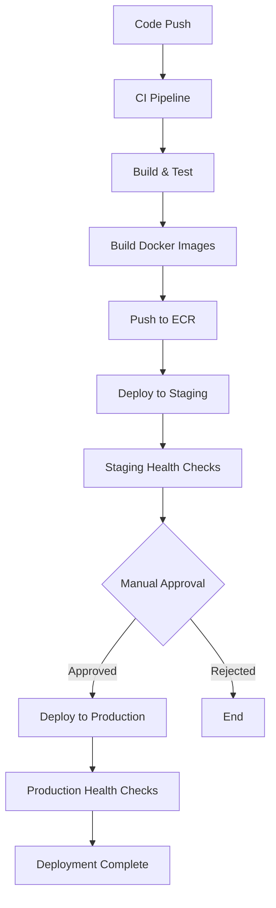

# CI/CD Integration with Kubernetes

This document outlines how Kubernetes deployment is integrated into the Mental Health PMS CI/CD pipeline, providing automated deployment capabilities for both staging and production environments.

## Overview

The CI/CD pipeline has been enhanced to support Kubernetes deployments alongside the existing ECS infrastructure, providing a modern, scalable, and cloud-native deployment strategy.

## Integration Components

### 1. GitHub Actions Workflows

#### Main CD Pipeline (`cd.yml`)
The continuous deployment workflow has been updated to include Kubernetes deployment steps:

- **Staging Deployment**: Automatically deploys to Kubernetes staging environment
- **Production Deployment**: Deploys to Kubernetes production environment with manual approval
- **Health Checks**: Validates deployment success using `kubectl` commands
- **Rollback Support**: Automatic rollback on deployment failure

#### Dedicated Kubernetes Workflow (`k8s-deploy.yml`)
A specialized workflow for Kubernetes operations:

- **Manual Trigger**: Workflow dispatch for on-demand deployments
- **Environment Selection**: Choose between staging and production
- **Deployment Method**: Support for both Helm and kubectl deployments
- **Validation**: Pre-deployment validation of Kubernetes manifests
- **Monitoring**: Post-deployment health checks and status reporting

### 2. Deployment Scripts

#### Core Kubernetes Scripts
- `deploy-k8s.sh`: Main deployment script with Blue/Green capabilities
- `rollback-k8s.sh`: Rollback script for failed deployments
- `cicd-k8s-deploy.sh`: Unified CI/CD deployment interface

#### CI/CD Integration Script (`cicd-k8s-deploy.sh`)
A comprehensive script designed specifically for CI/CD environments:

```bash
# Deploy to staging with Helm
./cicd-k8s-deploy.sh --environment staging --method helm --version v1.2.3

# Deploy to production with kubectl (dry run)
./cicd-k8s-deploy.sh -e production -m kubectl -v v1.2.3 --dry-run

# Force deploy without validation
./cicd-k8s-deploy.sh -e staging --force --skip-validation
```

### 3. Helm Chart Integration

#### Chart Structure
```
helm/pms/
├── Chart.yaml              # Chart metadata
├── values.yaml             # Default values
├── values-staging.yaml     # Staging environment values
├── values-production.yaml  # Production environment values
└── templates/
    ├── _helpers.tpl        # Template helpers
    ├── backend-deployment.yaml
    ├── frontend-deployment.yaml
    ├── configmap.yaml
    ├── secrets.yaml
    ├── ingress.yaml
    ├── hpa.yaml
    ├── pdb.yaml
    ├── networkpolicy.yaml
    └── rbac.yaml
```

#### Environment-Specific Values
- **Staging**: Lower resource limits, relaxed security policies
- **Production**: High availability, strict security, monitoring enabled

## CI/CD Pipeline Flow

### 1. Code Push/PR Merge


### 2. Staging Deployment
1. **Image Preparation**: Tag and push Docker images to ECR
2. **Kubernetes Setup**: Configure `kubectl` for staging cluster
3. **Deployment**: Execute deployment using `cicd-k8s-deploy.sh`
4. **Validation**: Wait for pods to be ready and perform health checks
5. **Notification**: Update deployment status and notify team

### 3. Production Deployment
1. **Manual Approval**: Require explicit approval for production deployment
2. **Version Backup**: Store current version for potential rollback
3. **Deployment**: Execute production deployment with enhanced monitoring
4. **Health Checks**: Comprehensive application and infrastructure validation
5. **Rollback**: Automatic rollback on failure (if enabled)

## Environment Configuration

### Required Environment Variables

#### GitHub Actions Secrets
```yaml
# AWS Configuration
AWS_ACCESS_KEY_ID: "AKIA..."
AWS_SECRET_ACCESS_KEY: "..."
AWS_REGION: "us-east-1"
ECR_REGISTRY: "123456789012.dkr.ecr.us-east-1.amazonaws.com"

# Kubernetes Configuration
KUBECONFIG_STAGING: "base64-encoded-kubeconfig"
KUBECONFIG_PRODUCTION: "base64-encoded-kubeconfig"

# Application Secrets
DATABASE_URL: "postgresql://..."
REDIS_URL: "redis://..."
SECRET_KEY: "..."
```

#### Runtime Environment Variables
```bash
# Deployment Configuration
ENVIRONMENT=staging|production
DEPLOYMENT_METHOD=helm|kubectl
VERSION=v1.2.3
DRY_RUN=true|false

# Git Information (automatically set by GitHub Actions)
GITHUB_SHA=commit-hash
GITHUB_REF_NAME=branch-or-tag-name
CI=true
```

## Deployment Methods

### 1. Helm Deployment (Recommended)

**Advantages:**
- Template-based configuration management
- Easy rollbacks with revision history
- Environment-specific value files
- Built-in validation and testing

**Usage:**
```bash
# Deploy with Helm
helm upgrade --install pms ./helm/pms \
  --values ./helm/pms/values-staging.yaml \
  --set global.version=v1.2.3 \
  --namespace pms-staging \
  --create-namespace \
  --wait
```

### 2. kubectl Deployment

**Advantages:**
- Direct Kubernetes API interaction
- Fine-grained control over resources
- Simpler for basic deployments

**Usage:**
```bash
# Deploy with kubectl
kubectl apply -f ./kubernetes/manifests/ \
  --namespace pms-staging
```

## Health Checks and Monitoring

### 1. Deployment Validation
- **Pod Readiness**: Ensure all pods are running and ready
- **Service Endpoints**: Verify service discovery and load balancing
- **Ingress Connectivity**: Test external access through ingress controller

### 2. Application Health Checks
- **Backend API**: `GET /health` endpoint validation
- **Frontend**: Root path accessibility check
- **Database Connectivity**: Connection pool and query validation
- **External Services**: Auth0, Redis, and other dependencies

### 3. Monitoring Integration
```bash
# Check deployment status
kubectl rollout status deployment/pms-backend -n pms-staging
kubectl rollout status deployment/pms-frontend -n pms-staging

# Verify pod health
kubectl get pods -n pms-staging -l app.kubernetes.io/name=pms

# Check service endpoints
kubectl get endpoints -n pms-staging
```

## Rollback Strategies

### 1. Automatic Rollback
Configured in CI/CD pipeline to automatically rollback on:
- Deployment timeout
- Health check failures
- Pod crash loops
- Service unavailability

### 2. Manual Rollback
```bash
# Helm rollback
helm rollback pms -n pms-staging

# kubectl rollback
kubectl rollout undo deployment/pms-backend -n pms-staging
kubectl rollout undo deployment/pms-frontend -n pms-staging

# Using rollback script
./rollback-k8s.sh --environment staging --method helm
```

## Security Considerations

### 1. Secret Management
- **Kubernetes Secrets**: Sensitive data stored as Kubernetes secrets
- **External Secret Management**: Integration with AWS Secrets Manager
- **RBAC**: Role-based access control for service accounts
- **Network Policies**: Traffic isolation between namespaces

### 2. Image Security
- **Image Scanning**: Automated vulnerability scanning in CI/CD
- **Signed Images**: Container image signing and verification
- **Private Registry**: ECR with restricted access
- **Security Contexts**: Non-root containers with security constraints

### 3. HIPAA Compliance
- **Encryption**: TLS in transit, encryption at rest
- **Audit Logging**: Comprehensive audit trails
- **Access Controls**: Strict authentication and authorization
- **Data Isolation**: Namespace and network-level isolation

## Troubleshooting

### Common Issues

#### 1. Deployment Failures
```bash
# Check deployment status
kubectl describe deployment pms-backend -n pms-staging

# Check pod logs
kubectl logs -l app=pms-backend -n pms-staging --tail=100

# Check events
kubectl get events -n pms-staging --sort-by='.lastTimestamp'
```

#### 2. Image Pull Issues
```bash
# Check image pull secrets
kubectl get secrets -n pms-staging

# Verify ECR authentication
aws ecr get-login-password --region us-east-1 | docker login --username AWS --password-stdin $ECR_REGISTRY
```

#### 3. Service Discovery Problems
```bash
# Check service configuration
kubectl describe service pms-backend -n pms-staging

# Test internal connectivity
kubectl run debug --rm -i --tty --image=busybox -- /bin/sh
# Inside the pod:
nslookup pms-backend.pms-staging.svc.cluster.local
```

### Debug Commands
```bash
# Get comprehensive cluster information
kubectl cluster-info dump --namespace pms-staging

# Check resource usage
kubectl top pods -n pms-staging
kubectl top nodes

# Validate configurations
kubectl apply --dry-run=client --validate=true -f ./kubernetes/manifests/
```

## Performance Optimization

### 1. Resource Management
- **Resource Requests/Limits**: Proper CPU and memory allocation
- **Horizontal Pod Autoscaling**: Automatic scaling based on metrics
- **Pod Disruption Budgets**: Maintain availability during updates
- **Node Affinity**: Optimize pod placement

### 2. Deployment Optimization
- **Rolling Updates**: Zero-downtime deployments
- **Readiness Probes**: Ensure pods are ready before receiving traffic
- **Liveness Probes**: Automatic restart of unhealthy pods
- **Startup Probes**: Handle slow-starting applications

## Monitoring and Observability

### 1. Metrics Collection
- **Prometheus**: Metrics collection and alerting
- **Grafana**: Visualization and dashboards
- **Application Metrics**: Custom business metrics
- **Infrastructure Metrics**: Node and cluster health

### 2. Logging
- **Centralized Logging**: ELK stack or CloudWatch integration
- **Structured Logging**: JSON-formatted application logs
- **Log Aggregation**: Namespace and application-level log collection
- **Audit Logs**: Kubernetes API audit logging

### 3. Tracing
- **Distributed Tracing**: Request flow across services
- **Performance Monitoring**: Application performance insights
- **Error Tracking**: Automated error detection and alerting

## Best Practices

### 1. CI/CD Pipeline
- **Immutable Deployments**: Never modify running containers
- **Environment Parity**: Keep staging and production similar
- **Automated Testing**: Comprehensive test coverage in pipeline
- **Gradual Rollouts**: Use canary or blue-green deployments

### 2. Configuration Management
- **GitOps**: Version control for all configurations
- **Environment Variables**: Use ConfigMaps and Secrets appropriately
- **Validation**: Validate configurations before deployment
- **Documentation**: Keep deployment documentation up-to-date

### 3. Security
- **Least Privilege**: Minimal required permissions
- **Regular Updates**: Keep base images and dependencies updated
- **Vulnerability Scanning**: Automated security scanning
- **Compliance**: Regular compliance audits and reviews

## Migration from ECS

For teams migrating from the existing ECS deployment:

1. **Parallel Deployment**: Run both ECS and Kubernetes initially
2. **Traffic Splitting**: Gradually shift traffic to Kubernetes
3. **Data Migration**: Ensure database and storage compatibility
4. **Monitoring**: Compare performance and reliability metrics
5. **Rollback Plan**: Maintain ability to rollback to ECS if needed

## Support and Maintenance

### Team Responsibilities
- **DevOps Team**: Infrastructure management and CI/CD pipeline
- **Development Team**: Application configuration and deployment
- **Security Team**: Security policies and compliance validation
- **Operations Team**: Monitoring, alerting, and incident response

### Regular Maintenance
- **Cluster Updates**: Regular Kubernetes version updates
- **Security Patches**: Timely application of security updates
- **Performance Review**: Regular performance and cost optimization
- **Disaster Recovery**: Regular backup and recovery testing

## Conclusion

The integration of Kubernetes into the CI/CD pipeline provides a robust, scalable, and secure deployment platform for the Mental Health PMS. The combination of automated deployments, comprehensive monitoring, and strong security controls ensures reliable service delivery while maintaining HIPAA compliance and operational excellence.

For additional support or questions, please refer to the team documentation or contact the DevOps team.