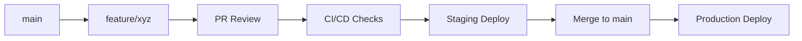

# Development Workflow Guide

This guide outlines the complete development workflow for the PMS application, following modern DevOps practices with strict quality gates and automated processes.

## Table of Contents

- [Overview](#overview)
- [Branch Strategy](#branch-strategy)
- [Development Process](#development-process)
- [CI/CD Pipeline](#cicd-pipeline)
- [Testing Requirements](#testing-requirements)
- [Deployment Process](#deployment-process)
- [Code Quality Standards](#code-quality-standards)
- [Security & Compliance](#security--compliance)
- [Troubleshooting](#troubleshooting)

## Overview

Our development workflow is built around:
- **GitHub Flow** with feature branches
- **Automated CI/CD** with quality gates
- **Mandatory testing** at all levels
- **Staged deployments** with rollback capabilities
- **HIPAA compliance** throughout the pipeline

### Key Principles

✅ **No Direct Commits**: All changes go through Pull Requests  
✅ **Automated Testing**: Every commit triggers comprehensive tests  
✅ **Quality Gates**: Code must pass all checks before merge  
✅ **Staged Deployment**: Automatic deployment to staging, manual to production  
✅ **Rollback Ready**: Every deployment can be quickly reverted  

---

## Branch Strategy

### Branch Protection Rules

The `main` branch is protected with the following rules:

- ❌ **Direct commits disabled**
- ✅ **Pull request required** with at least 1 approval
- ✅ **Status checks required**: `ci`, `quality`, `security`, `performance-budget`
- ✅ **Linear history enforced** (no merge commits)
- ✅ **Force pushes disabled**
- ✅ **Branch deletions disabled**
- ✅ **Admin enforcement enabled**

### Branch Naming Convention

```bash
# Feature development
feature/user-authentication
feature/payment-integration
feature/dashboard-redesign

# Bug fixes
bugfix/login-error
bugfix/memory-leak
bugfix/validation-issue

# Critical fixes
hotfix/security-patch
hotfix/data-corruption
hotfix/service-outage

# Release preparation
release/v2.1.0
release/v2.1.1
```

### Branch Lifecycle



---

## Development Process

### 1. Starting New Work

#### Using the CLI Script (Recommended)

```bash
# Initialize new feature branch
./scripts/init-feature.sh

# Follow interactive prompts:
# 1. Enter branch name (e.g., feature/user-dashboard)
# 2. Confirm creation
# 3. Review PR process reminders
```

#### Manual Process

```bash
# Ensure main is up to date
git checkout main
git pull origin main

# Create and switch to feature branch
git checkout -b feature/your-feature-name

# Push branch to remote
git push -u origin feature/your-feature-name
```

### 2. Development Workflow

```bash
# Make your changes
vim src/components/UserDashboard.tsx

# Run local tests
make test-local

# Run quality checks
make lint
make type-check

# Commit changes
git add .
git commit -m "feat: add user dashboard component"

# Push changes
git push origin feature/your-feature-name
```

### 3. Creating Pull Requests

#### PR Template Checklist

Every PR must complete this checklist:

- [ ] **Code tested locally**
- [ ] **All secrets removed / verified**
- [ ] **All tests passing**
- [ ] **Staging deployment passed**
- [ ] **Linked to issue**: #_____

#### PR Requirements

1. **Descriptive Title**: Use conventional commit format
   ```
   feat: add user authentication system
   fix: resolve memory leak in data processing
   docs: update API documentation
   ```

2. **Detailed Description**: Include:
   - What changes were made
   - Why the changes were necessary
   - How to test the changes
   - Any breaking changes
   - Screenshots (for UI changes)

3. **Issue Linking**: Every PR must link to a GitHub issue
   ```markdown
   Closes #123
   Fixes #456
   Related to #789
   ```

### 4. Code Review Process

#### Review Requirements

- **Minimum 1 approval** required
- **All CI checks** must pass
- **No unresolved conversations**
- **Branch must be up to date** with main

#### Review Guidelines

**For Reviewers:**
- Focus on logic, security, and maintainability
- Check for HIPAA compliance
- Verify test coverage
- Ensure documentation is updated
- Test locally if needed

**For Authors:**
- Respond to all feedback
- Make requested changes promptly
- Re-request review after changes
- Keep PRs focused and reasonably sized

---

## CI/CD Pipeline

### Automated Checks

Every commit triggers the following checks:

#### 1. **CI Pipeline** (`ci.yml`)
```yaml
✅ Code compilation
✅ Unit tests (backend & frontend)
✅ Integration tests
✅ Test coverage validation
✅ Docker image builds
```

#### 2. **Quality Pipeline** (`quality.yml`)
```yaml
✅ ESLint (frontend)
✅ Flake8 + Black (backend)
✅ Type checking (TypeScript/mypy)
✅ Code complexity analysis
✅ Dependency vulnerability scan
```

#### 3. **Security Pipeline** (`security.yml`)
```yaml
✅ Secret scanning (Gitleaks)
✅ SAST analysis (CodeQL)
✅ Dependency security scan
✅ Container security scan
✅ HIPAA compliance checks
```

#### 4. **Performance Budget** (`performance-budget.yml`)
```yaml
✅ Bundle size analysis
✅ Lighthouse performance audit
✅ Core Web Vitals validation
✅ API response time checks
```

### Pipeline Status

```bash
# Check pipeline status
gh pr checks

# View detailed logs
gh run view --log

# Re-run failed checks
gh run rerun
```

---

## Testing Requirements

### Test Pyramid

```
    /\     E2E Tests (10%)
   /  \    - Critical user journeys
  /____\   - Cross-browser testing
 /      \  Integration Tests (20%)
/        \ - API integration
\        / - Database interactions
 \______/  Unit Tests (70%)
           - Component logic
           - Business rules
```

### Testing Commands

```bash
# Run all tests
make test

# Backend tests
make test-backend
pytest apps/backend/tests/ -v --cov

# Frontend tests
make test-frontend
npm test -- --coverage

# E2E tests
make test-e2e
npx playwright test

# Performance tests
make test-performance
```

### Test Coverage Requirements

- **Minimum 80% overall coverage**
- **90% for critical business logic**
- **100% for security-related code**
- **All new code must include tests**

### Test Categories

#### Unit Tests
- Component behavior
- Business logic
- Utility functions
- Error handling

#### Integration Tests
- API endpoints
- Database operations
- External service integration
- Authentication flows

#### E2E Tests
- User registration/login
- Core application workflows
- Payment processing
- Data export/import

---

## Deployment Process

### Staging Deployment

**Automatic** - Triggered on every PR merge to `main`:

```yaml
1. Build application
2. Run database migrations
3. Deploy to staging environment
4. Run smoke tests
5. Update deployment status
```

**Staging Environment:**
- URL: `https://staging.pms.example.com`
- Database: Staging PostgreSQL
- Auth: Staging Auth0 tenant
- Monitoring: Staging Grafana

### Production Deployment

**Manual** - Triggered via GitHub Actions:

```bash
# Create production deployment
gh workflow run cd.yml --ref main

# Monitor deployment
gh run watch
```

**Production Deployment Steps:**

```yaml
1. Create deployment tag
2. Build production images
3. Run database migrations
4. Deploy with zero-downtime
5. Run health checks
6. Update monitoring
7. Send notifications
```

### Rollback Process

```bash
# Quick rollback to previous version
gh workflow run rollback.yml --ref main

# Rollback to specific version
gh workflow run rollback.yml --ref main -f version=v1.2.3
```

### Environment URLs

| Environment | URL | Purpose |
|-------------|-----|----------|
| Development | `http://localhost:3000` | Local development |
| Staging | `https://staging.pms.example.com` | Pre-production testing |
| Production | `https://pms.example.com` | Live application |

---

## Code Quality Standards

### Code Formatting

**Backend (Python):**
```bash
# Format code
black apps/backend/
flake8 apps/backend/
mypy apps/backend/
```

**Frontend (TypeScript):**
```bash
# Format code
npm run lint:fix
npm run type-check
npm run format
```

### Pre-commit Hooks

```bash
# Install pre-commit hooks
./scripts/install-git-hooks.sh

# Manual pre-commit check
pre-commit run --all-files
```

### Code Review Checklist

**Functionality:**
- [ ] Code works as intended
- [ ] Edge cases handled
- [ ] Error handling implemented
- [ ] Performance considerations

**Quality:**
- [ ] Code is readable and maintainable
- [ ] Follows established patterns
- [ ] No code duplication
- [ ] Appropriate abstractions

**Security:**
- [ ] No hardcoded secrets
- [ ] Input validation implemented
- [ ] HIPAA compliance maintained
- [ ] Authentication/authorization correct

**Testing:**
- [ ] Adequate test coverage
- [ ] Tests are meaningful
- [ ] Tests pass consistently
- [ ] Integration tests included

---

## Security & Compliance

### HIPAA Compliance

**Data Handling:**
- All PHI must be encrypted at rest and in transit
- Access logging for all PHI interactions
- Data retention policies enforced
- Audit trails maintained

**Development Practices:**
- No real PHI in development/staging
- Synthetic data for testing
- Regular security training
- Incident response procedures

### Security Scanning

**Automated Scans:**
- Secret detection (Gitleaks)
- Dependency vulnerabilities
- Container security
- Code analysis (CodeQL)

**Manual Reviews:**
- Security-focused code reviews
- Penetration testing
- Compliance audits
- Risk assessments

### Secrets Management

```bash
# Check for secrets before commit
gitleaks detect --source . --verbose

# Environment variables
# ✅ Use .env files for local development
# ✅ Use GitHub Secrets for CI/CD
# ✅ Use Kubernetes Secrets for production
# ❌ Never commit secrets to git
```

---

## Troubleshooting

### Common Issues

#### CI/CD Failures

**Test Failures:**
```bash
# Run tests locally
make test-local

# Check specific test
pytest apps/backend/tests/test_specific.py -v

# Debug with coverage
pytest --cov --cov-report=html
```

**Build Failures:**
```bash
# Check Docker build
docker build -t pms-backend apps/backend/

# Check dependencies
npm audit
pip check
```

**Deployment Failures:**
```bash
# Check deployment logs
kubectl logs -f deployment/pms-backend

# Check service status
kubectl get pods,services

# Rollback if needed
kubectl rollout undo deployment/pms-backend
```

#### Branch Protection Issues

**Cannot Push to Main:**
```bash
# This is expected - create a PR instead
git checkout -b feature/my-changes
git push origin feature/my-changes
# Then create PR via GitHub UI
```

**Status Checks Failing:**
```bash
# Check which checks are failing
gh pr checks

# Fix issues and push again
git add .
git commit -m "fix: resolve CI issues"
git push
```

#### Performance Issues

**Bundle Size Too Large:**
```bash
# Analyze bundle
npm run build:analyze

# Check for large dependencies
npm ls --depth=0

# Use dynamic imports
# const Component = lazy(() => import('./Component'));
```

**Slow Tests:**
```bash
# Profile test execution
pytest --durations=10

# Run tests in parallel
pytest -n auto
```

### Getting Help

1. **Documentation**: Check existing docs in `/docs`
2. **GitHub Issues**: Search existing issues
3. **Team Chat**: Ask in development channel
4. **Code Review**: Request help in PR comments
5. **Pair Programming**: Schedule session with team member

### Useful Commands

```bash
# Development helpers
make help                    # Show all available commands
make dev                     # Start development environment
make clean                   # Clean build artifacts
make reset                   # Reset development environment

# Git helpers
git log --oneline -10        # Recent commits
git branch -vv               # Branch status
git status --porcelain       # Clean status output

# GitHub CLI helpers
gh pr list                   # List PRs
gh pr view                   # View current PR
gh pr checks                 # Check PR status
gh workflow list             # List workflows
```

---

## Quick Reference

### Daily Workflow

```bash
# 1. Start new feature
./scripts/init-feature.sh

# 2. Develop and test
make dev
make test-local

# 3. Commit and push
git add .
git commit -m "feat: add new feature"
git push

# 4. Create PR
gh pr create --title "feat: add new feature" --body "Description"

# 5. Address review feedback
# Make changes, commit, push

# 6. Merge after approval
gh pr merge --squash
```

### Emergency Procedures

```bash
# Hotfix for production issue
git checkout main
git pull origin main
git checkout -b hotfix/critical-fix
# Make minimal fix
git commit -m "hotfix: resolve critical issue"
git push origin hotfix/critical-fix
# Create PR with "hotfix" label
# Fast-track review and merge
# Deploy immediately
```

### Key Files

- `/.github/workflows/` - CI/CD pipeline definitions
- `/.github/pull_request_template.md` - PR template
- `/scripts/init-feature.sh` - Feature branch initialization
- `/docs/dev-workflow.md` - This document
- `/Makefile` - Development commands
- `/.pre-commit-config.yaml` - Pre-commit hooks

---

**Remember**: This workflow is designed to maintain high code quality, security, and reliability. When in doubt, err on the side of caution and ask for help!

*Last updated: $(date +'%Y-%m-%d')*